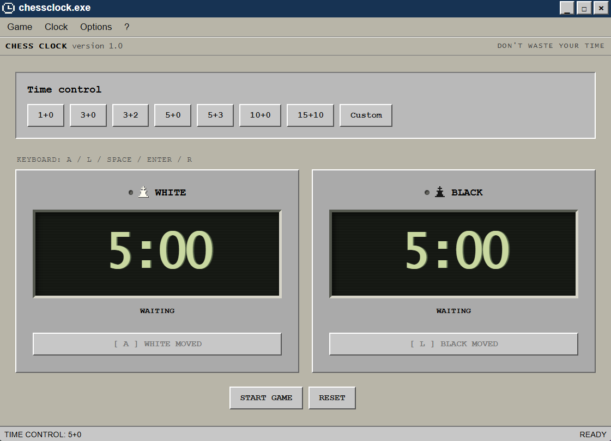
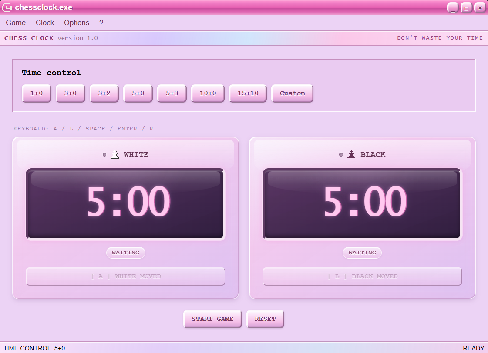
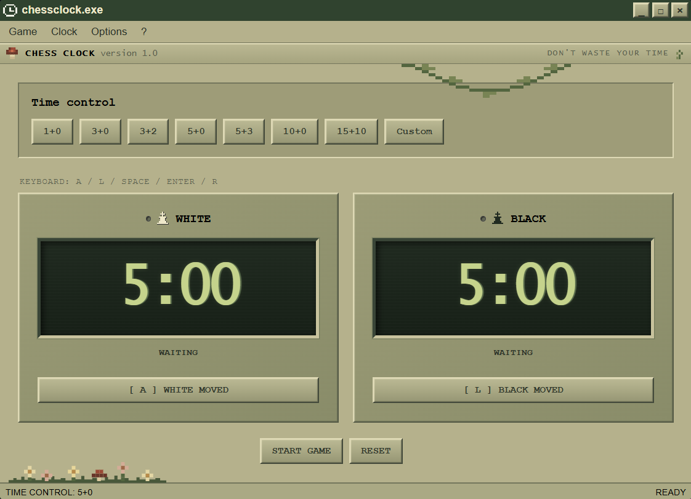

# Chess clock

A desktop chess clock built with React, TypeScript, and Tauri.

---

## Installation
Download the latest Windows installer from the [Releases](../../releases) page and run it to install the app.

## Screenshots

<p align="center">
    
    
    
</p>

## Features
- two-player chess clock
- preset and custom time controls
- optional Fischer increment
- pause and resume buttons
- timeout handling
- low-time precision with visual feedback
- optional visual effects
- three distinct themes
- keyboard controls
- native desktop window controls
- responsive window sizing

## Controls
- `Enter` - start game
- `A` - white finishes their move
- `L` - black finishes their move
- `Space` - pause/resume
- `R` - reset game

## Time controls
The clock includes multiple presets:

- `1+0`
- `3+0`
- `3+2`
- `5+0`
- `5+3`
- `10+0`
- `15+10`

There is also the option to configure custom time controls with a starting time and a Fischer increment.

## Themes

### Classic
A retro desktop-inspired chess clock with digital displays and system-style VFX.

### Bubblegum
A colorful Y2K-inspired theme with glossy UI elements and bubble effects.

### Nature
An overgrown retro interface with progressive degradation.

## Tech stack
- React
- TypeScript
- Vite
- Tauri
- Rust

## Development
Install dependencies:
```bash
npm install
```

Run the desktop app in development:
```bash
npm run tauri dev
```

Build the desktop app:
```bash
npm run tauri build
```